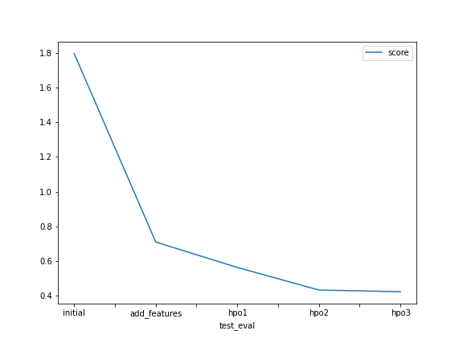

# Report: Predict Bike Sharing Demand with AutoGluon Solution
Tymur Salakhutdinov

## Initial Training
### What did you realize when you tried to submit your predictions? What changes were needed to the output of the predictor to submit your results?
It was suggested that there could be negative values in the predictions however in this particular case  there were no negative values in the predictions

### What was the top ranked model that performed?
WeightedEnsemble_L3 was the best performing model by the score. 

## Exploratory data analysis and feature creation
### What did the exploratory analysis find and how did you add additional features?
I have added columns 'weekday', 'hour' and 'month' in order to be able to perform some exploratory analysis based on these features.
During EDA I have found that:
 - while from Monday to Saturday there is quite similar values of mean and median number of bikes rented, on Sunday the mean and median are a bit lower. Therefore I have decided to add a feature 'is_sunday' with value '1' for sunday (weekday==6) and '0' otherwise
 - I have noticed that the number of rents can be split in 3 groups by the "month" feature:
     1. months 1-3 -> creating feature "is_winter" with the value '1' where the 1 <= month <= 3 and '0' otherwise
     2. months 5-10 -> creating feature "is_warm_month" with the value '1' where the 5 <= month <= 10 and '0' otherwise
     3. month 4,11,12 -> creating feature "is_cool_month" with the value '1' where the month == 4,11 or 12 and '0' otherwise
 
 - I can clearly separate number of bikes rented at different hours into 3 groups by comparing their means and medians: 
     1. the highest (compared to other groups) means and medians are observed from 8:00 to 9:00 and from 17:00 to 19:00 -> creating feature 'rush_hours' with value '1' for hours 8, 17, 18 and '0' for the rest
     2. the medium (compared to other groups) means and medians are observed from 7:00 to 8:00, from 9:00 to 17:00 and from 19:00 till 22:00 -> creating feature 'active_hours' with value '1' for hours 7, 9-16, 19-21 and '0' for the rest.
     3. the lowest (compared to other groups) means and medians are observed from 22:00 to 7:00 -> feature 'night_hours' with value '1' for hours 22-23, 0-6 and '0' for the rest
     
 - Analyzing the plot of means and medians of number of rents by temperature I have noticed that the number of rents can be separated into 3 groups by "temp" feature:
     1. temperature higher than 27 -> creating a feature "is_hot" with the value '1' where temp>=28 and '0' otherwise
     2. temperature between 13 and 27 -> creating a feature "is_warm" with the value '1' where 13<=temp<28 and '0' otherwise
     3. temperature lower than 13 -> creating a feature "is_cold" with the value '1' where temp<=13 and '0' otherwise
     
 - The plot of mean and median number of rents by "feels like" temperature looks very similar to "temperature" and probably there would be very similar (if not the same) groups if I separate, therefore I won't add a new feature because it won't ad a value (probably)
 - Analyzing the plot of means and medians of number of rents by humidity I noticed that the number of rents can be separated into 2 groups by "humidity" feature:
     - humidity higher than 63 -> creating a feature "is_very_humid" with the value '1' where humidity>=63 and '0' otherwise
 - when analyzing the plot of mean and median number of rents by windspeed I cannot notice any particular windspeed range where number of rents looks outstanding. Therefore I don't add any new feature
     
I have also converted features ["is_very_humid", "is_hot", "is_warm", "is_cold", "rush_hours", "active_hours", "night_hours", "is_winter", "is_warm_month", "is_cool_month","is_sunday","weekday","season","weather","holiday","workingday","hour","month","year"]
to category type as the numbers used there do not represent any quantitative feature but rather a type.

### How much better did your model preform after adding additional features and why do you think that is?
My model performed much better after adding the features. The root mean squared error decreased from -53.069 (kaggle score - 1.79592) to -30.200 (kaggle score - 0.71028). I think that is because the new features explicitly highlight relevant dependencies in the data. Together with the original features they describe the given data better than the original features do alone.

## Hyper parameter tuning
### How much better did your model preform after trying different hyper parameters?
After trying different hyperparameters the test score for the best training run decreased (the lower the better) almost by half: from 0.71028 to 0.42401

### If you were given more time with this dataset, where do you think you would spend more time?
I would spend more time on training each model separately and search for hyperparameters which produce better predictions

### Create a table with the models you ran, the hyperparameters modified, and the kaggle score.
	model	     time_limit	eval_metric	num_bag_sets	hyperparams search	models_used	                                                                        score
0	initial	     600	    rmse	    20	            False	            'KNN', 'RF', 'LGB', 'XT', 'NNFastAiTabular', 'WeightedEnsembleModel', 'CatBoost'	1.79592
1	add_features 600	    rmse	    20	            False	            'WeightedEnsembleModel', 'LGB', 'XT', 'KNN', 'RF', 'CatBoost', 'NNFastAiTabular'	0.71028
2	hpo1	     600	    rmsle	    20	            False	            'WeightedEnsembleModel', 'XT', 'NN_TORCH', 'RF', 'KNN'	                            0.56402
3	hpo2	     600	    rmsle	    40	            False	            'WeightedEnsembleModel', 'XT', 'NN_TORCH', 'RF'	                                    0.43380
4	hpo3	     1200	    rmsle	    60	            True	            'WeightedEnsembleModel', 'XT', 'NN_TORCH', 'RF'	                                    0.42401

### Create a line plot showing the top model score for the three (or more) training runs during the project.
Including 2 charts here one as I used two different evaluation metrics and the scores from those cannot be compared

### Create a line plot showing the top kaggle score for the three (or more) prediction submissions during the project.

## Summary
I have started with downloading "train" and "test" datasets and trying to train some models with basic autogluon parameters:
   - presets='best_quality'
   - eval_metric='root_mean_squared_error'
The result was quite poor comparing to the results in kaggle competition leaderboard.
As a second step I have performed exploratory analysis. First of all I parsed the datetime feature and created separate features for year, month, weekday etc. Then I plotted the distribution of mean and median number of rents against different values of every feature which has been provided in order to see if certain ranges of feature values can be new features themselves. I spotted new features can be created from ranges of values of features:
 - weekday
 - hour
 - month
 - temperature
 - humidity
After that I assigned "category" type to the features which represent rather type of something than certain number/quantity. Then I dropped "casual" and "registered" features as they are not included in test dataset and ran my training once again. The result was significantly better (0.71028 after EDA against 1.79592 of initial training). 

Before doing first HPO I have dug into kaggle competition forum and found out that log error is used to score the predictions. Hence I decided to apply this type of metric as evaluation metric when training my models leaving the other hyperparameters the unchanged. As a result the score improved (0.56402). Therefore I can assume using certain type of metric can improve the outcome.

For the second HPO I decided to keep only the best performing models. Moreover, after digging into autogluon help for possible hyperparameters optimization options I decided to increase the number of bag sets (num_bag_sets). It was suggested that it might improve the predictive performance and at the same time it won't cause overfitting as some other params (num_bag_folds, max_stack_level) might do. The result has improved again (0.43380). 
  - Moreover I have noticed that the score on the train dataset got lower while the score on the test dataset improved after the previous training run. Therefore I assume that the model after the 1st hpo could be overfitted.
 
For the 3rd hpo I decided to further increase num_bag_sets and try hyperparameter search for NN_TORCH model. I thought the training might take more time so I doubled the training time. As a result the score improved slightly (0.42401). 

I can conclude that EDA is very important for machine learning. Adding extra features, which help undestanding dependencies within given dataset, can improved predictive performance. Selecting certain evaluation metric, model and hyperparameters substantially improved predictive performance.

